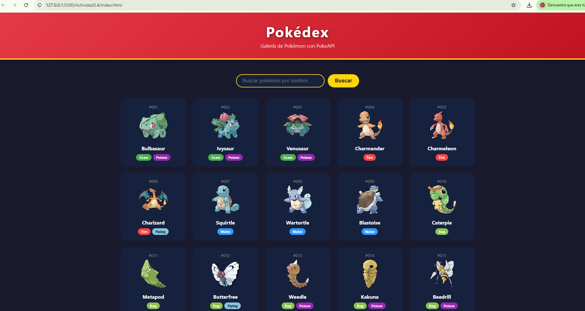
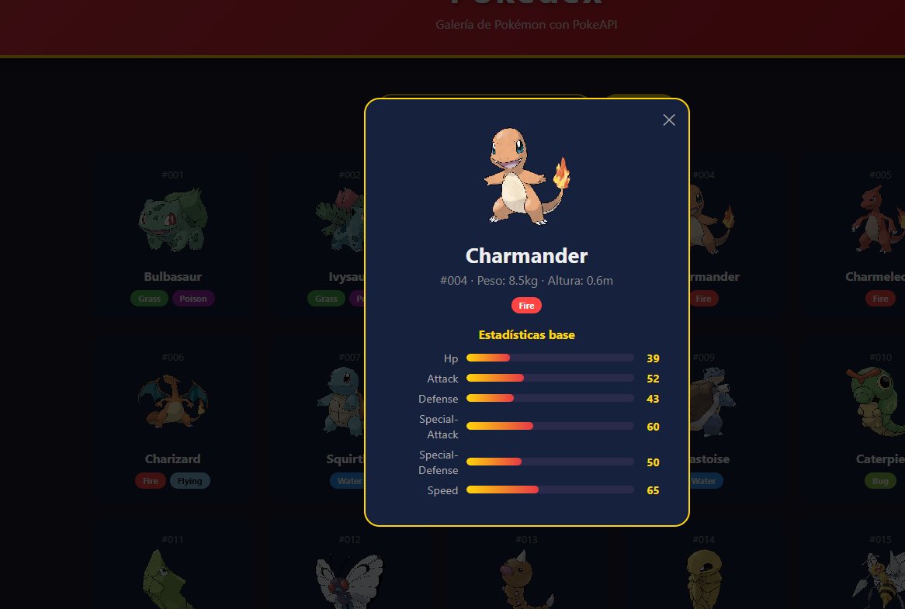
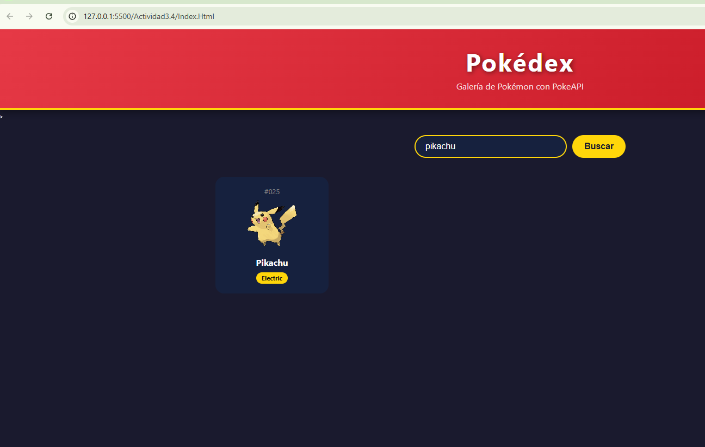
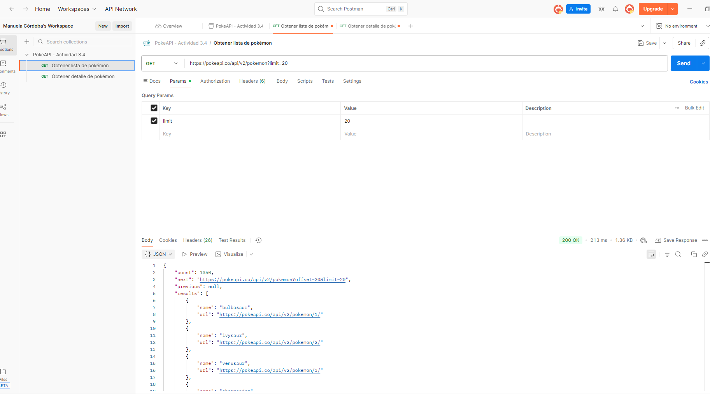
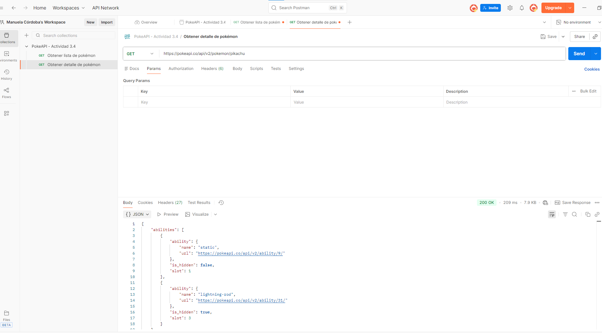

# Galería Pokémon 🎮

Aplicación web que consume la PokeAPI para mostrar una galería de pokémon con sus imágenes, tipos y estadísticas.

Proyecto hecho como actividad final GA1-AA2-EV04 del SENA.

---

## ¿Qué hace la aplicación?

- Muestra una galería de 20 pokémon al cargar la página
- Puedes buscar cualquier pokémon por nombre
- Al hacer clic en una tarjeta aparece un modal con estadísticas
- Botón Cargar más para ver más pokémon
- Muestra mensajes de error si la API falla

---

## API utilizada

PokeAPI → https://pokeapi.co

## Endpoints consumidos

- GET /pokemon?limit=20 → Lista paginada de pokémon
- GET /pokemon/nombre → Detalle de un pokémon específico

---

## Cómo ejecutar el proyecto

1. Abrir la carpeta en VS Code
2. Clic derecho en index.html → Open with Live Server
3. Se abre en http://127.0.0.1:5500

Necesitas internet para que la API funcione.

---

## Capturas de pantalla

### Galería principal

### Detalle del pokémon

### Búsqueda

---

## Pruebas en Postman

### Endpoint 1 - Lista de pokémon

### Endpoint 2 - Detalle de pokémon
